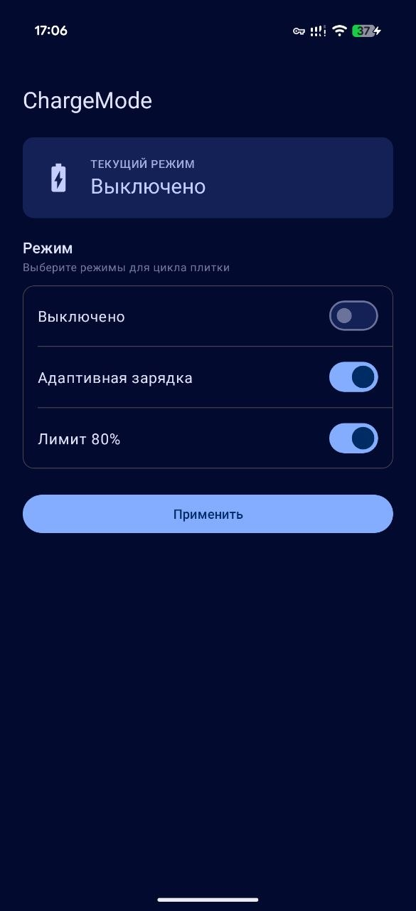
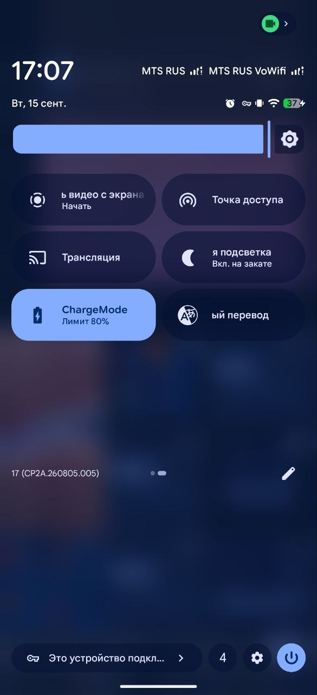
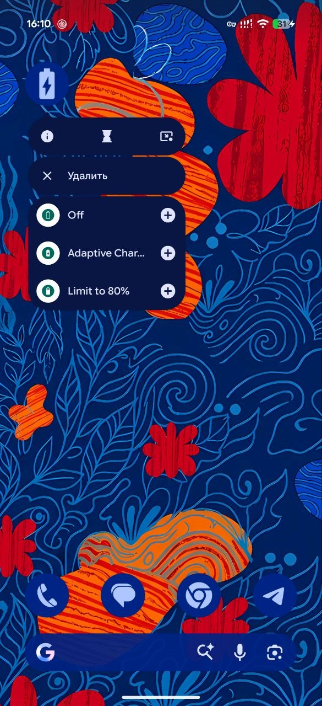

# ChargeMode

A Quick Settings tile that switches your phone's charging mode with one tap.

Some days you need a full charge before heading out; most days you'd rather
protect the battery long-term. ChargeMode lets you flip between charging
modes (Off / Adaptive Charging / Limit to 80%) right from Quick Settings,
instead of digging through Settings every time.

  
  
  

## Requirements

- Android 15 or newer
- [Shizuku](https://shizuku.rikka.app/), installed and running — no root needed

## Setup

1. Install [Shizuku](https://shizuku.rikka.app/) and start it.
2. Install ChargeMode and open it — grant Shizuku access when asked.
3. Pick which modes you want in the cycle, tap **Apply**.
4. Add the **Charge Cycle** tile to your Quick Settings shade.

## License

[MIT](LICENSE)
